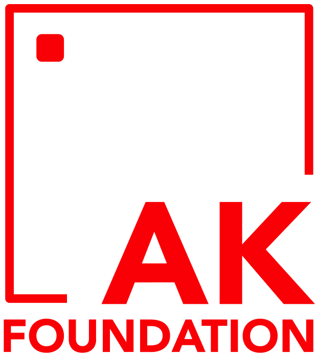
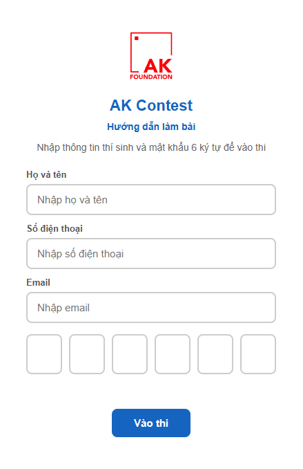
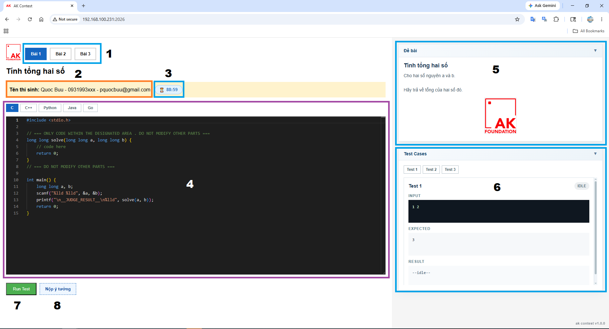
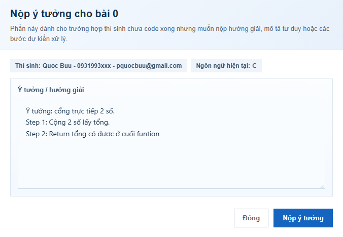
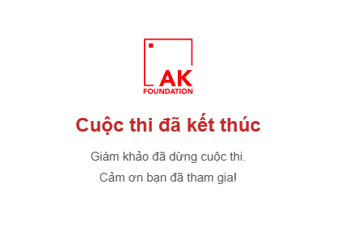

  

|[VN](ak-contest-guid.vn.md)|[EN](ak-contest-guid.en.md)|

# USER GUIDE - AK Contest

## I. Purpose

**AK Foundation Contest** is used to assess participants' algorithmic thinking and problem-solving ability. The results will be used to evaluate current capability levels and build a suitable training roadmap for the next stage.
Please complete the test based on your actual ability, without using AI or asking someone else to do it for you.

**Access link:** <a href="https://contest.akfoundation.vn" target="_blank">https://contest.akfoundation.vn</a>

## II. Login Instructions

  

**The login screen includes:** the Candidate Information section and the 6-character Password field.

**• Candidate Information:** Full name - Phone number - Email

(example: *Quoc Buu - 0931993xxx - pquocbuu@gmail.com*)

**• Password:** Provided by the organizing team when the contest begins.

## III. Contest Interface

  

**The contest interface includes:**

1) Problem list
- Includes Problem 1, Problem 2, and Problem 3. You can click to choose a problem to solve.

2) Candidate name.

3) Remaining time
- Displays the candidate's remaining time for the contest.

4) Code Editor
- Supported programming languages: C, C++, Python, Java, Go.
- Coding area: candidates write their solution based on the predefined function structure.

5) Problem statement
- Contains the description and requirements.

6) Test Cases
- List of tests (Test 1, Test 2, Test 3)
- Input
- Expected Output
- Result (execution result)
- Debug log (appears when running a test case and shows printed output)

7) "Run Test" button
- Used to run test cases, debug, and automatically submit when all test cases are completed.

8) Submit Idea
- If you have not finished the code, you can still describe your approach, intended algorithm, or implementation steps.
- The judges will review your thinking process and solution direction for additional evaluation.

  

## IV. Rules and Important Warnings

1) General rules
- Candidates must enter the correct information as instructed in the login guide.
- Each candidate may use only one main device to complete the contest.
- Opening multiple tabs or multiple browsers is not allowed.

2) Contest rules
- You may only write code in the system's Code Editor area.
- Do not modify the predefined function structure (except for the code inside it).
- Final results are calculated based on the score achieved for each problem and the completion time.

3) Programming language rules
- Only use languages supported by the system: C, C++, Python, Java, Go.

4) Time rules
- Candidates must complete the contest within the allotted time.
- The system will automatically lock the submission when time is up.

## V. End of the Contest

The contest will automatically display the end screen when the time is over or when the judges need to restart the assessment.

(*) If the judges restart the contest, you can press `F5` to rejoin.

  

