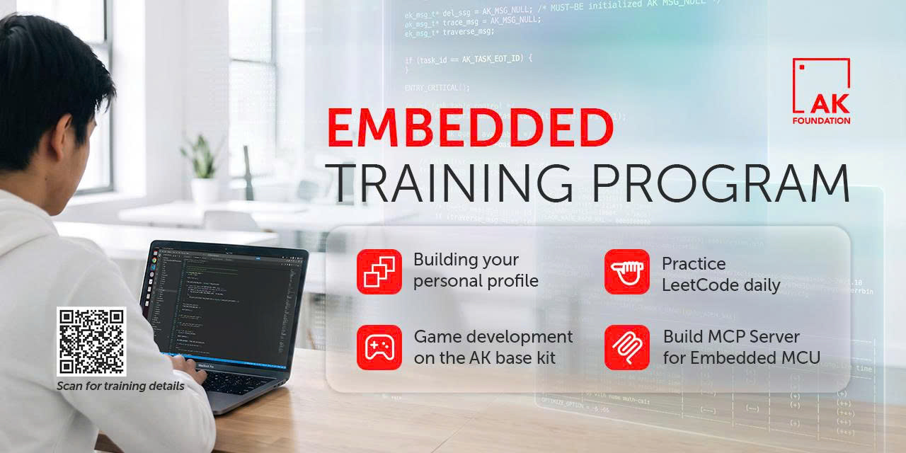
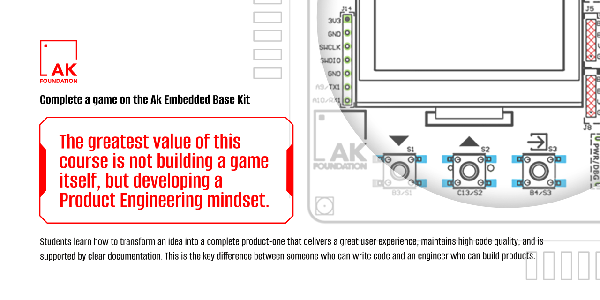

# Embedded training program

|**EN**|[**VN**](README_VN.md)|

The AK Foundation provides a structured Embedded training program with a clear roadmap, covering:

1. [Build your personal profile](#1-build-your-personal-profile)
2. [Practice LeetCode daily](#2-practice-leetcode-daily)
3. [AK base kit game development](#3-ak-base-kit-game-development)
4. [Agentic development using MCP](#4-agentic-development-using-mcp)

## 1. Build your personal profile

### Building a professional profile

  Think of your profile as a diary, documenting your learning and work results throughout your journey. Every time you complete something, share it with the world. Your thoughts, experiences, and enthusiasm are what draw people in.

  Every post and every commit is a chance to **look back at your journey**, reassess your direction, and adjust when needed. In the age of AI, recruiters want to see real people with a genuine online presence. A professional profile that reflects your individuality helps you build trust.

### The principles

- **Make it unique** - keep it concise and genuine, not polished like an ad. Templates are for references only, not for copying.
- **Less AI, more you** - the reader wants to understand you, not a whatever's produced by AI.
- **Use real photos** - need I say more?
- **Post in a variety of languages** - opens up broader opportunities, including foreign companies in Vietnam.
- **Show results, not just tasks** - specific numbers and impact are always more convincing than a list of duties.

### Creating and maintaining your profile

  Job searching is hard, but not having a strong look will only make it harder. During this training course, each student is required to create **at least 3 profiles**, with each profile **links** to the others.

#### LinkedIn

- **Show yourself** - show your work history, professional skills, and notable learning activities.
- **Stay active** - LinkedIn's algorithm favors active accounts, the more you active you are, the higher the chance you'll be seen.
- **Ask for referrals** - that could be from mentors or seniors - a genuine review from a real person is worth far more than a self-description.

#### GitHub

- **Select your pinned repositories** - every repository pinned on your profile is concrete evidence of your skills. Prioritize standout projects, use concise names, and write a clear `About` section.
- **Write clear documentation** - your `README.md` should include **screenshots or demo videos** so viewers can quickly understand the project's purpose, how it works, and its results. This is very important.
- **Follow consistent naming conventions** - choose one naming convention and use it consistently for files, branches, and source-code components.
- **Write meaningful commit messages** - messages such as `fix bug` or `update code` are too vague. A commit message should clearly describe what you fixed or changed.
- **Commit regularly** - commit each logical change to show a clear development history. Avoid bundling every change into a single commit.
- **Pin your most important repositories** - pin the projects that best demonstrate your abilities, including a personal profile repository. This is often one of the first areas recruiters review.

#### Examples

- **Zack Hoang**

 

- **Cao Trong Phuoc**

 

## 2. Practice LeetCode daily

### Tips

- **Practice daily** - try to commit to at least one problem everyday and slowly build yourself up to harder problems.
- **Sync your submissions to a GitHub repo** - here's a guide: [How to sync LeetCode submissions to GitHub](https://github.com/caotrongphuoc/algorithms/blob/embedded-algorithm/how-to-submit-code-from-LeetCode-to-GitHub.md)

### Why it matters

  In the AI era, technology evolves rapidly. The ability to learn and adapt quickly is essential for every engineer. While LeetCode skills alone are not always needed in a day to day basis, the ability to solve problems fast and reason it through will always be essential.

### LeetCode helps you

- Improve reading comprehension and information absorption.
- Strengthen problem-solving and logical thinking.
- Keep your brain challenged beyond repetitive daily work.
- Prepare for technical interviews at top technology companies.

  Consistent LeetCode practices can significantly improve your thinking speed and problem-solving efficiency.

### Resources

- Recommended roadmap for Embedded Engineers: [algorithm_roadmap.md](https://github.com/the-ak-foundation/embedded-training-program/blob/main/01-algorithm-practice/roadmap/algorithm_roadmap.md)
- AK Contest Guide: [ak-contest-guide.en.md](https://github.com/the-ak-foundation/embedded-training-program/blob/main/01-algorithm-practice/contest-guide/ak-contest-guide.en.md)

Start with **Embedded Algorithm - Week 1**, which has already reached  . Start now on [LeetCode](https://LeetCode.com/problem-list/w5s9pzgi/) · See the upcoming weeks in the [Algorithm roadmap](https://github.com/the-ak-foundation/embedded-training-program/blob/main/01-algorithm-practice/roadmap/algorithm_roadmap.md).

  > **Note:** The contest platform is normally closed and is only opened during the official AK Foundation training programs and competitions.
>

## 3. AK base kit game development

### Purpose

This course aims to help you develop the mindset and skills required to become a product engineer. Here is a [sample game](https://github.com/the-ak-foundation/archery-game)

The greatest value of this course is **not building a game itself, but developing a product engineering mindset**. Students learn how to transform an idea into a complete product-one that delivers a great user experience, maintains high code quality, and is supported by clear documentation. This is the key difference between someone who can write code and an engineer who can build products.

Base on the AK Embedded Base Kit source code, you will develop and complete a game that meets the following requirements:

- Deliver an engaging gameplay experience.
- Write clean, concise, and maintainable code.
- Create clear design documentation that is consistent with the source code.
- Complete a software from concept to a fully usable application.

In practice, delivering a product that meets 100% of its requirements is extremely challenging. Many engineers can make a product function correctly, but often fall short in areas such as user experience, code quality, and documentation.

Through this course, you will learn that a great product does not just work. It must also be easy to use, maintainable, and ready for future development.

Over nearly 10 years of training Embedded interns and engineers, with more than 1,000 students participating in our programs, only a handful have been able to complete 100% of the requirements. Most students typically achieve around 60–80% of the expected outcomes.

### Upon completing this course, you will be able to

- Understand the resource limitations of embedded systems and learn how to maximize application performance.
- Gain experience delivering a complete project with a meaningful level of complexity.
- Learn how to work with and extend a large existing codebase.
- Understand the key elements required to build a high-quality product, rather than simply implementing features.
- Develop the discipline, attention to detail, and perseverance needed to bring a product to completion.

## 4. Agentic development using MCP

Perhaps most of us as developers all face this same scenario: we begin introducing AI agents into our codebase, they generate a couple hundreds of lines of code and what comes out does not at all follow our project's specifications, but we accept it anyway. We keep pretending that everything is fine but our gut feeling tells us something is not right.

Lack of context is what keeps our agents from running the way we intended. Our agents has no understanding of our project's standards. They are things that, us, humans, might have internally agreed, are not externalized into forms that agents could understand.

### What MCP provides for agents

There are various ways to initialize MCP and they all provide the same things:

- **Convention**: how to name variables, folders, files, formatting rules, etc.
- **Rules**: what our agents can and can not do in our codebase
- **Workflow**: how agents should begin a new driver, module or feature

AK Foundation has an in-house, ready to use, MCP server that will speed up learners' development time, with 3 parts:

- **Tools**: agents' permitted actions
- **Resources**: this could include external documentation for agents' reference
- **Prompts**: repeated, standardized prompts within our project

Tools are what makes agents shine. An agent that has a clear reasoning cycle outperforms one that could only guess a project's internal working.

### Understanding the framework

MCP is only as good as our input quality. If we want to use MCP effectively, we must understand what our project needs and how to best document those standards to communicate with our agents. With a clearly documented MCP server, we could comfortably scale up or down with our AI model and our code quality is still guaranteed.
