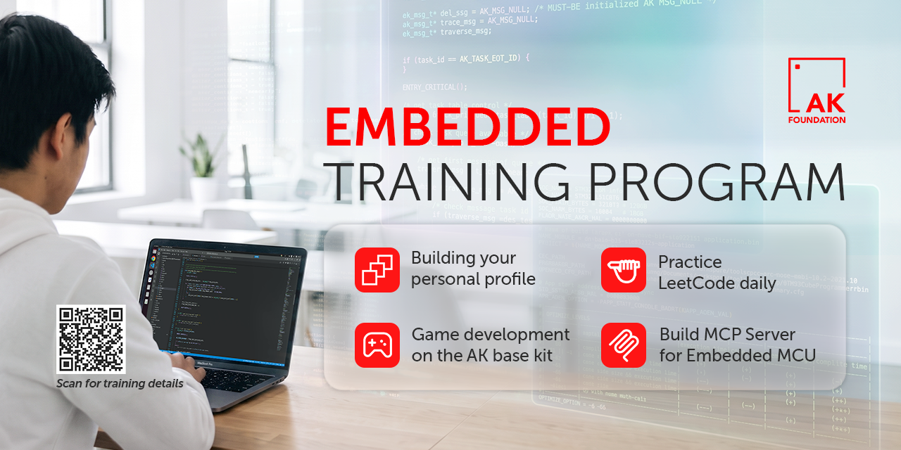

# Embedded training program

|[**EN**](README.md)|**VN**|

AK Foundation cung cấp chương trình đào tạo Embedded có lộ trình và cấu trúc, bao gồm các nội dung:

1. [Xây dựng personal profile](#1-xây-dựng-personal-profile)
2. [Luyện thuật toán với LeetCode](#2-luyện-thuật-toán-với-leetcode)
3. [Phát triển game trên AK Base Kit](#3-phát-triển-game-trên-ak-base-kit)
4. [Sử dụng MCP cho AI agent](#4-sử-dụng-mcp-cho-ai-agent)

## 1. Xây dựng personal profile

### Xây dựng profile chuyên nghiệp

Hãy xem profile như một cuốn nhật ký, ghi lại quá trình học tập và kết quả công việc. Mỗi khi hoàn thành điều gì đó, hãy chia sẻ nó với mọi người. Suy nghĩ, trải nghiệm và sự nhiệt huyết của bạn là những điều thu hút người xem.

Mỗi bài đăng và mỗi commit là cơ hội để **nhìn lại hành trình của chính mình**, đánh giá lại định hướng và điều chỉnh khi cần. Trong thời đại AI, nhà tuyển dụng muốn thấy một con người thật với sự hiện diện trực tuyến thật. Một profile chuyên nghiệp, mang đậm dấu ấn cá nhân sẽ giúp bạn tạo dựng sự tin tưởng.

### Nguyên tắc

- **Hãy tạo dấu ấn riêng** - ngắn gọn và chân thật, không trau chuốt như quảng cáo. Template chỉ để tham khảo, không phải để sao chép.
- **Ít AI hơn, nhiều bản thân hơn** - người đọc muốn hiểu về bạn, không phải nội dung chung chung do AI tạo ra.
- **Dùng ảnh thật** - không cần nói nhiều thêm.
- **Đăng bài bằng nhiều ngôn ngữ** - mở ra nhiều cơ hội hơn, bao gồm các công ty nước ngoài tại Việt Nam.
- **Thể hiện kết quả, không chỉ công việc đã làm** - số liệu và tác động cụ thể luôn thuyết phục hơn danh sách nhiệm vụ.

### Tạo và duy trì hồ sơ

Tìm việc vốn đã khó; không có personal profile tốt sẽ càng khó hơn. Trong khóa đào tạo này, mỗi học viên cần tạo **ít nhất 3 profile**, và các profile phải **liên kết** với nhau.

#### LinkedIn

- **Thể hiện bản thân** - trình bày kinh nghiệm làm việc, kỹ năng chuyên môn và các hoạt động học tập nổi bật.
- **Duy trì hoạt động** - thuật toán LinkedIn ưu tiên tài khoản hoạt động; bạn càng hoạt động, cơ hội được nhìn thấy càng cao.
- **Xin lời giới thiệu** - từ mentor hoặc anh chị đi trước. Một nhận xét chân thành từ người thật có giá trị hơn nhiều so với tự mô tả.

#### GitHub

- **Select your pinned repositories** - mỗi repository được ghim trên trang cá nhân là một minh chứng cụ thể cho kỹ năng của bạn. Hãy ưu tiên những dự án nổi bật, đặt tên ngắn gọn và viết phần mô tả (`About`) rõ ràng.
- **Write clear documentation** - file `README.md` nên có `ảnh chụp màn hình hoặc video demo` để người xem nhanh chóng hiểu được mục tiêu, cách hoạt động và kết quả của dự án. Đây là phần rất quan trọng.
- **Follow consistent naming conventions** - chọn một quy ước đặt tên và áp dụng nhất quán cho file, branch và các thành phần trong source code.
- **Write meaningful commit messages** - nội dung như `fix bug` hoặc `update code` quá chung chung. `Commit message` nên nói rõ bạn đã sửa hoặc thay đổi điều gì.
- **Commit regularly** - commit theo từng thay đổi hợp lý để thể hiện rõ quá trình phát triển của dự án. Tránh dồn toàn bộ thay đổi vào một commit duy nhất.
- **Pin your most important repositories** - ghim những dự án thể hiện tốt nhất năng lực của bạn, bao gồm cả personal profile repository. Đây thường là một trong những khu vực đầu tiên nhà tuyển dụng xem.

#### Personal profile examples

- **Zack Hoang**

 

- **Cao Trong Phuoc**

 

## 2. Luyện thuật toán với LeetCode

### Mẹo

- **Luyện tập hằng ngày** - cố gắng giải ít nhất một bài mỗi ngày, rồi dần nâng độ khó.
- **Đồng bộ bài nộp lên GitHub** - xem hướng dẫn: [How to sync LeetCode submissions to GitHub](https://github.com/caotrongphuoc/algorithms/blob/embedded-algorithm/how-to-submit-code-from-LeetCode-to-GitHub.md).

### Vì sao điều này quan trọng

Trong thời đại AI, công nghệ phát triển rất nhanh. Khả năng học và thích nghi nhanh là điều thiết yếu với mọi kỹ sư. Kỹ năng LeetCode không phải lúc nào cũng được dùng hằng ngày, nhưng khả năng giải quyết vấn đề nhanh và lập luận chặt chẽ luôn cần thiết.

### LeetCode giúp bạn

- Cải thiện khả năng đọc hiểu và tiếp thu thông tin.
- Rèn luyện tư duy logic và giải quyết vấn đề.
- Giữ não bộ được thử thách, vượt ra ngoài những công việc lặp lại hằng ngày.
- Chuẩn bị cho các vòng phỏng vấn kỹ thuật tại những công ty công nghệ hàng đầu.

Luyện LeetCode đều đặn có thể cải thiện đáng kể tốc độ tư duy và hiệu quả giải quyết vấn đề.

### Resources

- Lộ trình đề xuất cho Embedded Engineer: [algorithm_roadmap.md](https://github.com/the-ak-foundation/embedded-training-program/blob/main/01-algorithm-practice/roadmap/algorithm_roadmap.md)
- Hướng dẫn AK Contest: [ak-contest-guide.en.md](https://github.com/the-ak-foundation/embedded-training-program/blob/main/01-algorithm-practice/contest-guide/ak-contest-guide.en.md)

Hãy bắt đầu với **Embedded Algorithm - Week 1**, hiện đã có  . Bắt đầu ngay trên [LeetCode](https://leetcode.com/problem-list/w5s9pzgi/)· Xem lộ trình các week tiếp theo tại [Algorithm roadmap](https://github.com/the-ak-foundation/embedded-training-program/blob/main/01-algorithm-practice/roadmap/algorithm_roadmap.md).

> **Lưu ý:** Nền tảng contest thường đóng và chỉ được mở trong các chương trình đào tạo, cuộc thi chính thức của AK Foundation.

## 3. Phát triển game trên AK Base Kit

### Mục đích

Khóa học này giúp bạn phát triển tư duy và kỹ năng cần thiết để trở thành product engineer. Xem [sample game](https://github.com/the-ak-foundation/archery-game).

Giá trị lớn nhất của khóa học **không phải là làm game**, mà là phát triển tư duy kỹ sư sản phẩm. Học viên học cách biến một ý tưởng thành sản phẩm hoàn chỉnh: mang lại trải nghiệm người dùng tốt, giữ chất lượng mã nguồn cao và có tài liệu rõ ràng. Đây là điểm khác biệt giữa người biết viết code và kỹ sư có thể xây dựng sản phẩm.

Dựa trên mã nguồn AK Embedded Base Kit, bạn sẽ phát triển và hoàn thiện một game đáp ứng các yêu cầu:

- Mang lại trải nghiệm chơi hấp dẫn.
- Viết mã nguồn sạch, ngắn gọn và dễ bảo trì.
- Tạo tài liệu thiết kế rõ ràng, nhất quán với mã nguồn.
- Hoàn thiện phần mềm từ ý tưởng đến ứng dụng có thể sử dụng.

Trong thực tế, việc cung cấp sản phẩm đáp ứng 100% yêu cầu rất khó. Nhiều kỹ sư có thể làm sản phẩm hoạt động đúng, nhưng thường chưa đạt về trải nghiệm người dùng, chất lượng mã nguồn và tài liệu.

Qua khóa học, bạn sẽ hiểu rằng một sản phẩm tốt không chỉ hoạt động. Nó còn phải dễ dùng, dễ bảo trì và sẵn sàng để phát triển trong tương lai.

Trong gần 10 năm đào tạo Embedded intern và engineer, với hơn 1.000 học viên tham gia, chỉ một số ít có thể hoàn thành 100% yêu cầu. Phần lớn học viên thường đạt khoảng 60–80% kết quả mong đợi.

### Sau khi hoàn thành khóa học, bạn có thể

- Hiểu giới hạn tài nguyên của hệ thống nhúng và cách tối ưu hiệu năng ứng dụng.
- Có kinh nghiệm hoàn thiện một dự án có độ phức tạp thực tế.
- Biết cách làm việc với và mở rộng một codebase lớn có sẵn.
- Hiểu những yếu tố cốt lõi tạo nên sản phẩm chất lượng cao, thay vì chỉ triển khai tính năng.
- Rèn tính kỷ luật, sự tỉ mỉ và kiên trì để đưa sản phẩm đến khi hoàn thành.

## 4. Sử dụng MCP cho AI agent

Ai từng giao cho AI agent viết code trong dự án lớn đều gặp cùng một kịch bản: agent sinh ra vài trăm dòng, chạy được nhưng không theo style và quy tắc của team. Diff dài quá, ta lười đọc, bấm accept. Lần sau agent viết nhiều hơn, ta lười hơn và nó lệch dần khỏi hướng mình muốn. Kết cục là mất niềm tin: test sơ qua thấy chạy đúng, nhưng trong lòng vẫn không chắc.

Nguyên nhân thường không nằm ở model, mà ở chỗ agent không biết gì về thế giới của bạn. Những quy tắc cả team đều thuộc lòng lại chưa bao giờ được viết ra ở dạng agent đọc được. Vậy nên việc cần làm là xây cơ sở tri thức cho agent, bằng SKILLS, bằng MCP, hoặc cả hai.

### MCP cung cấp gì cho agent

MCP có thể triển khai online qua một domain, hoặc offline qua CLI chạy ngay trên máy. Dù cách nào, nó mang lại cho agent:

- **Style của codebase**: cách đặt tên, cấu trúc thư mục, quy ước comment, format.
- **Quy tắc phải tuân theo**: những gì team đã thống nhất, không cần bàn lại mỗi lần.
- **Hướng dẫn triển khai**: công thức từng bước để thêm một module, một driver, một tính năng.
- **Giới hạn và điều cấm**: thư mục read-only, API deprecated, chỗ agent không được tự ý sửa.
- **Quy trình bắt buộc**: tự debug, nạp code chạy test thật, commit xong từng tính năng rồi mới đi tiếp.

Cấu trúc gồm ba phần: **Tools** (hành động agent gọi được: build, nạp code, đọc log UART, chạy test), **Resources** (kho tri thức tra cứu) và Prompts (quy trình đóng gói sẵn).

Trong đó **Tools** tạo khác biệt lớn nhất. Một agent tự build được, tự đọc được log lỗi, tự chạy được test là agent có vòng phản hồi khép kín, thay vì viết code rồi ngồi đoán là nó đúng.

### Vì sao phải hiểu thật rõ framework

Đây là phần không có đường tắt, và cũng là phần quyết định thành bại.

MCP chỉ tốt đúng bằng tri thức bạn nạp vào. Muốn viết ra được quy tắc, bạn phải biết quy tắc nào thật sự quan trọng và quy tắc nào chỉ là thói quen. Muốn đặt giới hạn, bạn phải biết chỗ nào trong framework là nhạy cảm, sửa vào là hỏng. Muốn viết hướng dẫn triển khai, bạn phải nắm được con đường đúng để thêm một tính năng, chứ không phải con đường đầu tiên nghĩ ra.

Nói cách khác, **xây MCP thực chất là quá trình biến tri thức ngầm của team thành tri thức tường minh**. Phần lớn công sức nằm ở đó, không nằm ở code của MCP server.
Một ưu điểm khác: khi tri thức đã nằm sẵn trong MCP, Agent không cần "thông minh" để đoán ra style của bạn nữa, chỉ cần đọc và làm theo. Bạn có thể hạ xuống model rẻ hơn mà vẫn yên tâm về chất lượng.

Đầu tư vào cơ sở tri thức, suy cho cùng, là đầu tư vào niềm tin. Khi đã tin được, bạn mới thật sự bắt đầu đi nhanh.
